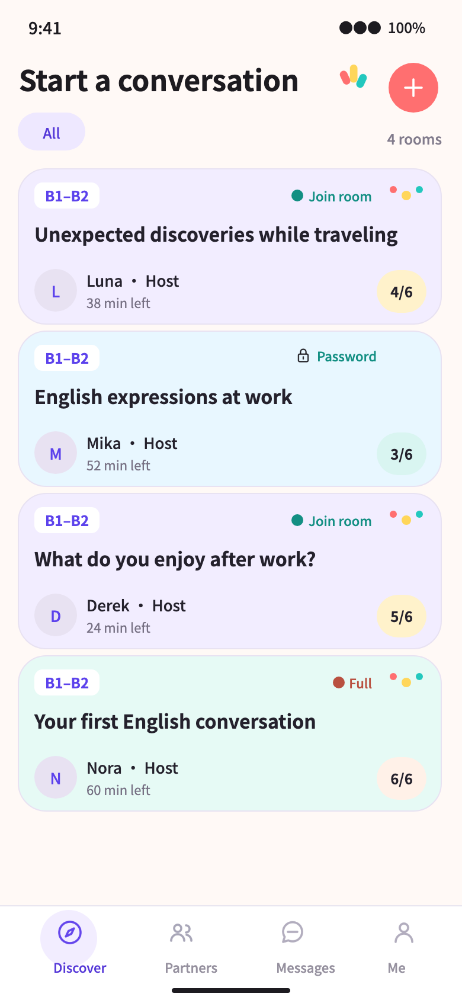
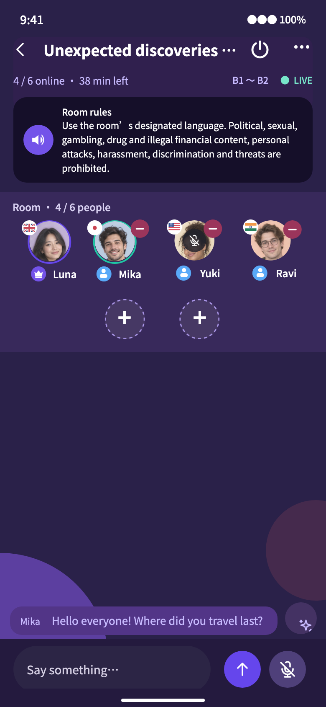
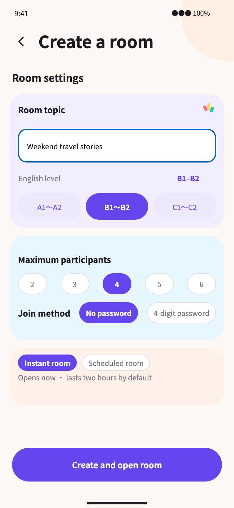
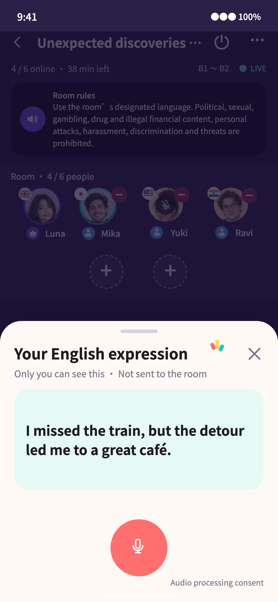
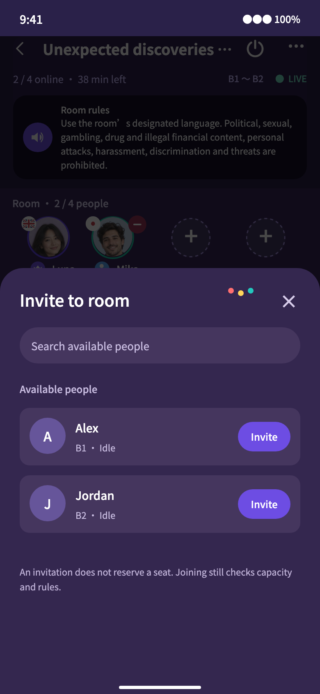
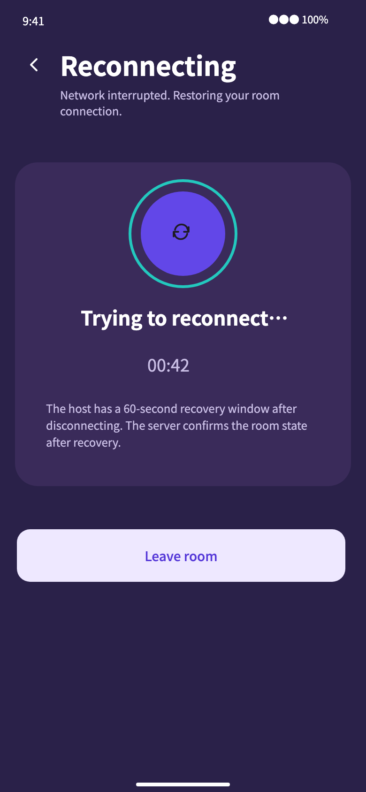
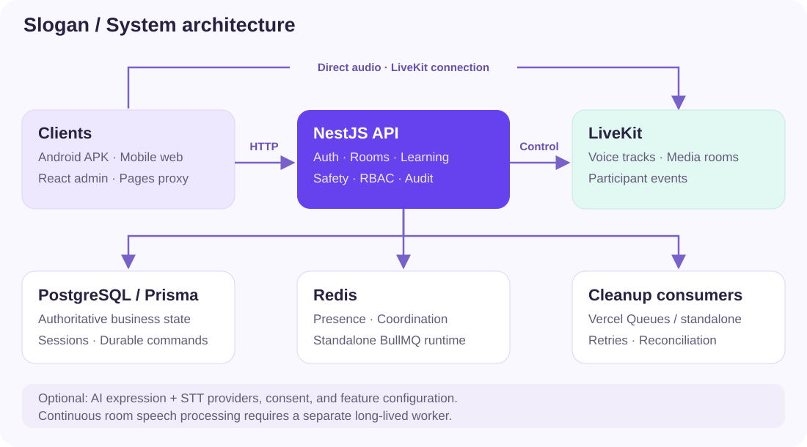
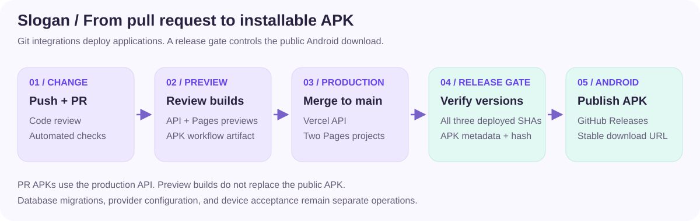

<p align="center">
  
</p>

<h1 align="center">Slogan</h1>

<p align="center">用真实对话练习英语：发现房间、开口交流、积累自己的表达。</p>

<p align="center">
  <strong>中文</strong> · <a href="README.md">English</a><br />
  <a href="https://slogan-preview-mobile.pages.dev">Web 体验</a> ·
  <a href="https://slogan-preview-mobile.pages.dev/downloads/android">Android 下载</a> ·
  <a href="https://slogan-preview-admin.pages.dev">管理后台</a>
</p>

Slogan 是面向英语口语练习的实时语音社区，包含 Android / Web 客户端、管理后台和 NestJS API。用户按英语等级与话题加入 2–6 人语音房，在交流中发送文字、邀请伙伴，并通过母语表达辅助找到合适的英文说法。后台提供房间管理、安全案件、限制申诉、权限和操作审计。

项目使用 TypeScript 与 pnpm monorepo，重点处理真实产品中的房间生命周期、实时服务与数据库一致性、会话安全，以及前后端和 APK 的交付一致性。目前处于 `0.0.x` 受控体验阶段。

## 目录

- [在线体验](#在线体验)
- [界面预览](#界面预览)
- [功能与当前范围](#功能与当前范围)
- [系统架构](#系统架构)
- [技术栈](#技术栈)
- [本地运行](#本地运行)
- [配置与接口](#配置与接口)
- [验证与交付](#验证与交付)
- [项目文档](#项目文档)
- [参与开发与许可证](#参与开发与许可证)

## 在线体验

| 入口       | 地址                                                                                                                                                | 说明                                                           |
| ---------- | --------------------------------------------------------------------------------------------------------------------------------------------------- | -------------------------------------------------------------- |
| Web 客户端 | [打开 Slogan](https://slogan-preview-mobile.pages.dev)                                                                                              | 浏览器需要麦克风权限；语音连接需要网络可达                     |
| Android    | [下载页](https://slogan-preview-mobile.pages.dev/downloads/android) / [直接下载 APK](https://slogan-preview-mobile.pages.dev/downloads/android.apk) | 当前提供 arm64 APK；使用固定体验签名，尚未配置应用商店正式签名 |
| 管理后台   | [打开后台](https://slogan-preview-admin.pages.dev)                                                                                                  | 需要对应后台权限                                               |
| 构建记录   | [GitHub Releases](https://github.com/cuilongsheng/Slogan/releases)                                                                                  | 查看发布提交、APK 与校验信息                                   |

体验使用由项目维护者分配的五个预置账号：一名平台管理员、一名安全员、三名普通用户。房主身份来自当前房间成员关系，不是全局账号角色。账号密码不会公开在仓库中。

截至 2026-10-10，公开体验环境使用预置账号密码登录；Google 登录和邮件注册流程关闭。实际登录能力以 API 的 `GET /v1/auth/capabilities` 返回为准。自行部署需要单独配置身份服务，不能直接复用线上账号。

## 界面预览

以下为实际移动端组件在 React Native Web 下的英文运行截图，统一使用 390 × 844 视口。房间、人物和接口响应使用隔离的验收样例数据；截图展示界面与交互状态，不代表生产用户、真实语音或 Android 真机验证。

<table>
  <tr>
    <th>发现房间</th><th>语音房</th><th>创建房间</th>
  </tr>
  <tr>
    <td></td>
    <td></td>
    <td></td>
  </tr>
  <tr>
    <th>母语表达辅助</th><th>站内邀请</th><th>网络重连</th>
  </tr>
  <tr>
    <td></td>
    <td></td>
    <td></td>
  </tr>
</table>

截图来源、样例边界和生成方式见 [图片说明](docs/readme/README.md)。

## 功能与当前范围

| 模块           | 已实现的能力                                                                                           | 边界                                                                |
| -------------- | ------------------------------------------------------------------------------------------------------ | ------------------------------------------------------------------- |
| 房间发现与创建 | 房间列表、即时 / 预约房间、2–6 人容量、A1～A2 / B1～B2 / C1～C2、四位房间密码                          | 语言筛选与话题分类暂未加入；发现列表头像预览缺少接口字段            |
| 入房与语音     | 点击房间直接加入；密码房弹出密码输入；自动检查麦克风与音频问题；LiveKit 语音、静音、成员状态、网络重连 | 真实语音需配置 LiveKit；设备权限和音频表现需真机验证                |
| 房间互动       | 房间内文字消息、每行四个席位、成员管理、房主接替、快速退出                                             | 文字消息属于房间会话，不是一对一私聊                                |
| 站内邀请       | 房主从当前在线空闲候选中选择伙伴发送邀请；登录后的前台在线心跳                                         | 邀请不预占席位，接受时仍由后端校验资格与容量                        |
| 表达与学习     | 按住说母语、松开获取英文；录制期间房间麦克风静音；词汇收藏、限制与申诉、退出账号                       | AI / 语音转写依赖外部服务、功能开关与处理同意，不保证每个部署都启用 |
| 管理后台       | 进行中 / 预约房间、完整房间卡片、安全案件、限制申诉、降级事件、角色权限、操作审计                      | 后台授权由服务端执行；当前后台界面主要为中文                        |
| 自动交付       | PR 预览、Android 构建、合并后生产部署、受发布门槛控制的 APK 下载地址                                   | 数据库迁移需要单独执行；PR APK 默认连接生产 API                     |

独立“找伙伴”页面、一对一聊天会话列表及私聊尚未完成，发现页对应导航仍为静态项；iOS 发布暂缓。持续房间语音处理、会后关键词及部分治理能力有后端实现，但需要独立配置、工作进程和外部服务验收。完整产品要求与在途变更见 [OpenSpec](openspec/)；不能仅根据页面入口判断功能已完成。

## 系统架构



移动端和后台通过 HTTP 调用 NestJS 控制层；语音音轨由客户端直接连接 LiveKit。PostgreSQL 保存账号、会话、房间、成员、消息与持久命令等业务事实，Redis 用于在线状态、协调和独立运行时队列。Vercel 环境使用托管队列消费短时实时清理任务。

主要设计点：

- **数据库与实时服务分工**：数据库决定成员资格和房间状态；LiveKit 承载媒体连接，服务端结合凭证版本与恢复规则处理过期连接。
- **快速退出与可靠清理**：业务退出和待执行清理命令持久化后即可返回；后台执行实时服务清理并重试，用户不需要等待 LiveKit 完成。
- **权限与会话**：后台角色与房主身份分离；短期访问令牌、可撤销刷新会话、浏览器 HttpOnly 刷新 Cookie 与原生 SecureStore 分别处理客户端会话。
- **单一接口合同**：NestJS 生成 `openapi/openapi.yaml`，前端从合同生成类型与客户端，避免手写另一套接口定义。
- **分层模块化后端**：presentation 接收请求，application 编排用例，domain 定义业务规则，infrastructure 对接数据库和外部服务。
- **验收与发布分开**：自动测试、原稿视觉对照、线上核对和真机音频验证分别提供证据，构建通过不等于所有环境验收完成。

持续采集房间语音的 worker 与短时清理消费者是两类运行任务。需要持续音频处理时，必须部署适合长连接的 worker；不能用一次托管队列调用替代持续音频进程。详见 [Vercel 队列部署](docs/deployment/room-experience-vercel-queues.md)。

## 技术栈

| 层           | 技术                                                                    |
| ------------ | ----------------------------------------------------------------------- |
| 工作区       | TypeScript、Node.js 24.21.0、pnpm 12.3.4                                |
| 手机端 / Web | React 19、React Native 0.86、Expo 57、Expo Router、React Native Web     |
| 管理后台     | React、Vite、React Router、TanStack Query、Tailwind CSS                 |
| 后端         | NestJS 12、Prisma 7、PostgreSQL、Redis、BullMQ、Vercel Queues           |
| 实时音频     | LiveKit 客户端与服务端 SDK                                              |
| 合同与验证   | OpenAPI、openapi-typescript、Jest、Vitest、Playwright                   |
| 发布         | Vercel API、Cloudflare Pages、GitHub Actions / Releases、Android Gradle |

```text
apps/
  mobile/       Android 与 Web 客户端
  admin/        管理后台
  api/          NestJS API、Prisma 迁移与 worker
packages/
  api-client/   基于 OpenAPI 的类型与客户端
  shared/       跨应用共享的纯 TypeScript 定义
openapi/        唯一发布的 API 合同
openspec/       当前要求、变更方案与归档
assets/         品牌、字体与设计资源
tests/          端到端与视觉运行 harness
scripts/        Pages 构建、交付及依赖检查
docs/           开发、部署、验收与发布记录
```

## 本地运行

需要 Git、Node.js（推荐 nvm）、pnpm、Docker 与 Docker Compose。Android 原生构建另外需要 JDK / Android SDK；版本与构建流程见 [Android 交付文档](docs/deployment/android-automatic-delivery.md)。

### 1. 安装与环境文件

```bash
git clone https://github.com/cuilongsheng/Slogan.git
cd Slogan
nvm use
corepack enable
pnpm install --frozen-lockfile

cp apps/api/.env.example apps/api/.env
cp apps/admin/.env.example apps/admin/.env
cp apps/mobile/.env.example apps/mobile/.env
```

在 `apps/api/.env` 中分别为 `JWT_ACCESS_SECRET`、`REFRESH_TOKEN_PEPPER` 和 `ROOM_PASSWORD_PEPPER` 设置至少 32 字符的独立随机值。示例中的替换文本不能用于公开部署。外部能力默认关闭，先保留关闭状态；不要提交实际 `.env` 或账号文件。

### 2. 启动本地数据服务并迁移

```bash
docker compose -f apps/api/docker-compose.dev.yml up -d --wait
pnpm --filter @slogan/api db:migrate:deploy
```

此 Compose 启动本地 PostgreSQL 与 Redis，使用示例 `.env` 中对应的本地地址。迁移命令针对当前 `DATABASE_URL` 执行，运行前确认它指向本地数据库。

### 3. 分别启动三个应用

```bash
# 终端 1：API，默认 http://localhost:3000
pnpm dev:api

# 终端 2：管理后台，默认 http://localhost:5173
pnpm dev:admin

# 终端 3：移动端 Web，http://localhost:8082
pnpm --filter @slogan/mobile exec expo start --web --port 8082
```

前端开发环境中的 API base URL 使用 `http://localhost:3000`，不附加 `/v1`。新数据库不会自动创建体验账号，按 [账号预置指南](docs/preview-accounts-runbook.md) 配置受控账号与权限后登录。完整邮件注册需要另外配置邮件服务，见 [邮件认证指南](docs/email-password-auth-runbook.md)。

需要真实语音时，在 API 中配置 `REALTIME_ENABLED`、`LIVEKIT_*` 和 `REDIS_URL`，并按 [实时部署指南](docs/deployment/room-experience-vercel-queues.md) 启动相应消费者。基础页面运行不代表语音服务已就绪。

原生 LiveKit 使用自定义原生模块，需要开发构建或 APK，不能通过 Expo Go 验证完整语音。手机访问本机 API 时，应使用可达的局域网地址并配置监听地址、Origin 白名单与设备网络；手机上的 `localhost` 指向手机自己。

## 配置与接口

| 配置范围     | 入口                                                      | 用途                                                                       |
| ------------ | --------------------------------------------------------- | -------------------------------------------------------------------------- |
| API          | [apps/api/.env.example](apps/api/.env.example)            | 数据库、会话密钥、Origin 白名单、认证、LiveKit、Redis、AI / STT 与治理开关 |
| 后台         | [apps/admin/.env.example](apps/admin/.env.example)        | `VITE_API_BASE_URL`                                                        |
| 手机端       | [apps/mobile/.env.example](apps/mobile/.env.example)      | `EXPO_PUBLIC_API_BASE_URL`                                                 |
| 开发数据服务 | [docker-compose.dev.yml](apps/api/docker-compose.dev.yml) | 本地 PostgreSQL / Redis                                                    |

浏览器认证同时检查允许的 Origin；前端地址变化后要更新 API 的相关白名单并重新部署。`EXPO_PUBLIC_*` 与 `VITE_*` 属于客户端可见配置，不应放服务端密钥。

公开 Pages 部署使用同源 `/v1` 代理，因此两个前端变量应填**各自站点的完整 HTTPS Origin**，而不是直接填后端域名。原生 Android 构建则连接 Vercel API。具体取值与代理边界见 [自动交付配置](docs/deployment/android-automatic-delivery.md)。

接口以 [openapi/openapi.yaml](openapi/openapi.yaml) 为准。更新 API 后按以下顺序生成合同与客户端，再检查漂移：

```bash
pnpm --filter @slogan/api openapi:generate
pnpm --filter @slogan/api-client generate
pnpm --filter @slogan/api openapi:check
pnpm --filter @slogan/api-client generate:check
```

不要手动修改生成的客户端类型。客户端使用方式见 [API client 文档](packages/api-client/README.md)，后端学习与模块说明见 [API README](apps/api/README.md)。

## 验证与交付

按变更范围选择检查：

```bash
pnpm lint
pnpm typecheck
pnpm deps:check
pnpm test
pnpm build

# API 集成 / 端到端验证：会启动隔离的测试数据库
pnpm verify:api

# 页面、视觉和浏览器流程
pnpm test:e2e

# 仓库完整验证入口
pnpm verify
```

数据库测试需要 Docker；外部服务与设备相关能力还需要单独验收。视觉 harness 使用显式测试适配器运行真实组件，不连接生产账号或真实音频服务。验收范围与差异记录见 [验收文档](docs/acceptance/README.md)。



| 触发          | API / 前端                               | Android                                                              |
| ------------- | ---------------------------------------- | -------------------------------------------------------------------- |
| PR / 分支提交 | Git 集成生成 Vercel 与 Pages 预览部署    | Actions 构建可下载的工作流产物；不替换公共 APK                       |
| 合并到 `main` | Vercel 和两个 Pages 项目自动部署生产版本 | 构建后核对三个线上版本及发布检查，成功后更新 Releases 与固定下载入口 |

APK 发布门槛会核对 API 的 `x-slogan-commit`、两个 Pages 的 `release.json`、当前 `main`、APK 元数据及 SHA-256。下载页从发布元数据读取最新产物；不把大型 APK 提交到前端源码里。PR 构建的 APK 当前使用生产 API，不自动指向该 PR 的后端预览。

API 构建不会自动执行 Prisma 迁移。涉及数据库结构的发布，需要按 [部署 runbook](docs/runbooks/deployment.md) 先处理备份、兼容性迁移和回滚顺序。Redis 配置与数据生命周期也独立于 Git 自动部署。

## 项目文档

完整文档入口见 [docs/README.md](docs/README.md)。工程文档使用英文，项目首页提供中英两版，界面保留中文支持。

| 主题         | 文档                                                                                                                                                                           |
| ------------ | ------------------------------------------------------------------------------------------------------------------------------------------------------------------------------ |
| 当前产品要求 | [OpenSpec 主规格](openspec/specs/) / [在途变更](openspec/changes/)                                                                                                             |
| 工程约定     | [项目指南](AGENTS.md) / [交付生命周期](workflow/delivery-lifecycle.md)                                                                                                         |
| 开发与结构   | [开发文档](docs/development.md) / [结构说明](docs/architecture/project-structure.md)                                                                                           |
| 后端与合同   | [API README](apps/api/README.md) / [OpenAPI 合同](openapi/openapi.yaml)                                                                                                        |
| 账号配置     | [受控体验账号](docs/preview-accounts-runbook.md) / [邮件认证](docs/email-password-auth-runbook.md)                                                                             |
| 交付与运维   | [Android 自动交付](docs/deployment/android-automatic-delivery.md) / [实时队列](docs/deployment/room-experience-vercel-queues.md) / [部署 runbook](docs/runbooks/deployment.md) |
| 证据与发布   | [验收记录](docs/acceptance/) / [发布记录](docs/releases/)                                                                                                                      |

部分文档是特定时间、提交或阶段的记录，应结合其日期与范围阅读。`docs/init/PRD_V1.md` 是冻结的历史基线；当前产品要求以 OpenSpec 为准，接口以 OpenAPI 为准，视觉以确认的 Figma 原稿为准。

## 参与开发与许可证

功能变更先通过 OpenSpec 明确行为与范围，再实施并提供相关验证证据。Figma 文件只通过已连接的 Desktop Bridge 访问；界面还原需要原稿与实际运行页面直接对照。提交中不应包含密钥、预置账号密码或用户原始音频。

代码采用 [MIT License](LICENSE)。第三方资源遵循各自许可证，例如 [字体 OFL](assets/fonts/OFL.txt) 与 [国旗图标 MIT](docs/design/icons/country-flags/LICENSE)。
