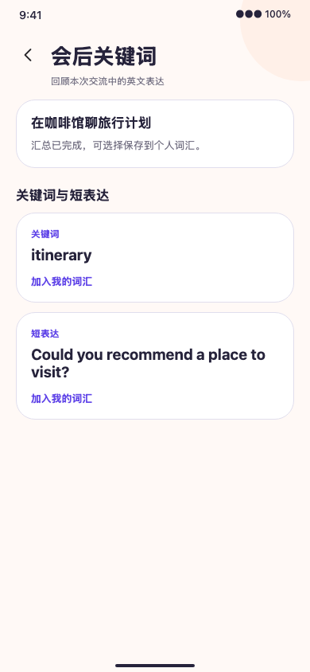

# 手机端会后关键词与个人词汇验收

2026-09-28，本地实现对应 `implement-mobile-post-room-learning`。

## 实现与行为

- 只有历史列表中已结束且本人实际参与的房间显示会后关键词入口。页面从本人授权 API 读取 `DISABLED/PENDING/READY/UNAVAILABLE` 状态；仅 `READY` 显示关键词和短表达，不展示音频、转写或成员信息。
- 用户逐条点击“加入我的词汇”。同一条目发生网络失败时保留 `clientRequestId` 重试；成功后当前页面显示已加入。后端按来源条目与本人建立唯一约束，重复进入页面后再导入会返回既有私有条目。
- 个人页增加“我的词汇”；列表使用服务端分页、类型和收藏筛选。编辑显示文本/个人备注、切换收藏及确认删除均携带 `expectedVersion`；409 保留草稿，需用户主动加载最新列表。

## 本地验证

- `pnpm --filter @slogan/mobile lint`、`typecheck`：通过。
- `pnpm --filter @slogan/mobile test`：35 suites、97 tests 通过；覆盖 API 参数和版本、`PENDING` 不显示导入、同条目网络重试幂等、编辑冲突保留输入及筛选重置。
- `pnpm --filter @slogan/mobile exec expo export --platform ios --output-dir dist-ios`：通过，仅证明 iOS JS bundle 可导出。
- `pnpm exec playwright test tests/e2e/mobile-learning-visual.e2e.spec.ts --reporter=line`：390×844 夹具 1/1 通过，覆盖历史入口、汇总导入、个人词汇和收藏。
- `openspec validate implement-mobile-post-room-learning --strict`：通过。

## 证据边界

用户允许沿用 V2 设计语言，这两页没有独立 Figma 帧，因此截图只证明页面布局和交互，不是逐帧 1:1 对照。Playwright 使用确定性 API 夹具；真实账号房间生成、LiveKit Cloud/STT provider 与原生设备验收仍待完成。会后关键词后端 change 的真实 provider smoke 目前仍标记 BLOCKED，不能把本地夹具当成生成成功证据。
