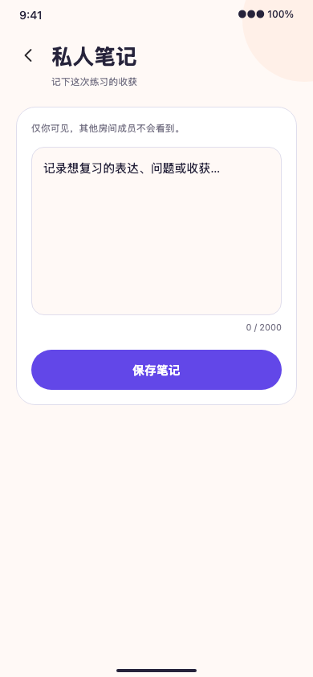

# 手机端房间历史与私人笔记验收

2026-09-28，本地实现对应 `implement-mobile-room-history-notes`。

## 实现与行为

- `/me` 新增“房间历史”入口；`/me/history` 从本人历史接口分页加载，区分已参与与仅预约，并显示状态、类型、CEFR 和时间。
- 只有已参与且房间已结束的记录显示笔记入口；`/me/history/[roomId]` 通过本人令牌读取私人笔记。
- 保存和清空携带 `expectedVersion`。409 冲突保留本地草稿、禁用旧版本保存，用户选择“加载最新笔记”后才替换草稿；网络失败不显示已保存。

## 本地验证

- `pnpm --filter @slogan/mobile lint`、`typecheck`：通过。
- `pnpm --filter @slogan/mobile test`：32 suites、91 tests 通过；覆盖接口请求、参与和预约区分、冲突草稿保留、清空版本。
- `pnpm --filter @slogan/mobile exec expo export --platform ios --output-dir dist-ios`：通过，仅证明 iOS JS bundle 可导出。
- `pnpm exec playwright test tests/e2e/mobile-history-visual.e2e.spec.ts --reporter=line`：390×844 夹具 1/1 通过，覆盖入口、仅预约无笔记入口、笔记保存版本 0→1。
- `openspec validate implement-mobile-room-history-notes --strict`：通过。

## 证据边界

用户同意沿用 V2 设计语言，此功能无独立 Figma 帧，因此截图不构成 1:1 对照。Playwright 使用确定性 API 夹具；真实账号历史与原生设备验收尚未完成。无其他成员笔记访问权限的最终裁决仍由后端负责。
