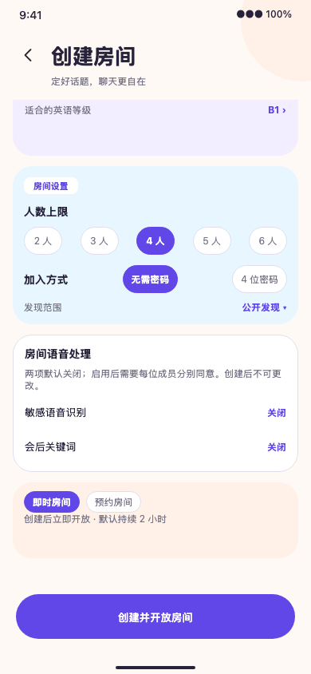
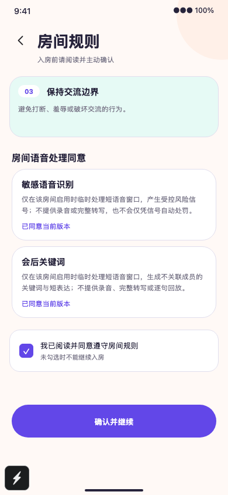
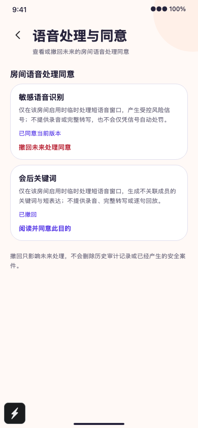

# Selection and acceptance of room voice processing on mobile phone

2026-09-28, the local implementation corresponds to `implement-mobile-room-processing-consents`.

## Behavior

- Sensitive speech recognition and post-session keywords are turned off by default for instant and scheduled house building, and two Boolean values are explicitly sent when submitting. When opening any purpose, the current consent status of the user must be read first; the user must actively accept each purpose. If the current description version of the server is inconsistent with the copywriting version of the client, it is prohibited to continue. When the backend refuses to enable the service or lacks consent, the page displays the corresponding error and does not show that the creation was successful.
- The room list and details display two processing options saved by the server before joining, including the closed status; rooms with enabled purposes require current consent one by one on the rules page. The read failed to clear the old state and cannot be released based on the cache. Failed command retry will use the original `clientRequestId`.
- `/me/room-processing` shows two projects with independent withdrawals. The page explicitly withdraws only affects future processing and does not delete historical audits and security cases that have occurred.

## Local evidence

- Mobile phone lint, typecheck, iOS JS export passed; Jest 40 suites, 106 tests passed. iOS export only proves that the JS bundle can be exported.
- `tests/e2e/mobile-room-consents-visual.e2e.spec.ts` 390×844 browser fixture 2/2, independent acceptance of access control and single-item withdrawal through binoculars; creation page visual fixture 1/1. The screenshot is as follows.
- `openspec validate implement-mobile-room-processing-consents --strict` passed.

## border

The new processing selection and consent area is a supplementary interaction based on the approved V2 visual language and OpenSpec requirements, and is not a pixel-by-pixel restoration of the original Figma frame. The processing description copy comes from the current OpenSpec constraints; product and privacy copy confirmation must still be completed before going online. The browser fixture does not replace live accounts, LiveKit/STT providers, native device permissions, and double-ended room acceptance. The local backend configuration turns off two provider capabilities by default, and the server will refuse to create them when the selection is enabled.
