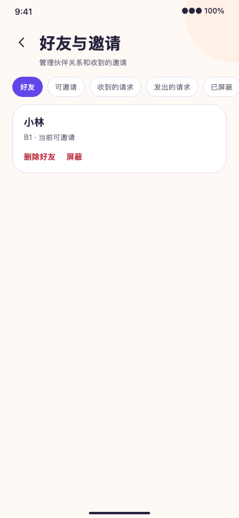
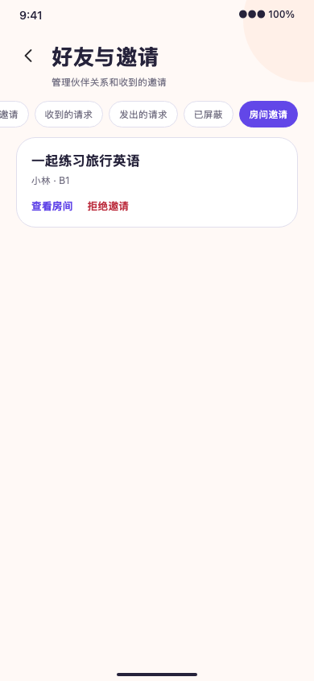

# 手机端好友与邀请验收

2026-09-28，本地实现对应 `implement-mobile-social`。

## 实现与行为

- `/me/social` 提供好友、可邀请用户、收到/发出的好友请求、已屏蔽用户及收到的房间邀请六个分页列表。
- 好友请求列表后端补充对方当前公开昵称；持久层明确挑选公开响应字段，防止 Prisma 关系对象和出生年月等字段泄漏。E2E 验证响应字段精确集合及其他用户不可读。
- 发起/接受/拒绝/撤回好友请求、删除好友、屏蔽/解除和拒绝房间邀请均使用 UUID 命令标识；不确定结果同一动作重试沿用标识。本人在线心跳只在该页前台可见时根据服务端建议间隔续期。
- 邀请“查看房间”进入既有详情和加入准备流程，`invitationId` 随准备草稿传至 membership 请求。密码、容量、规则与资格仍由后端重新校验。

## 本地验证

- API lint/typecheck/OpenAPI check 与生成客户端检查：通过。`test/e2e/social.e2e.spec.ts` 5/5 通过，覆盖公开昵称最小字段、关系隔离与邀请加入校验。
- 移动端 lint/typecheck：通过；37 suites、101 tests 通过，覆盖社交授权 API、失败重试的相同请求标识、邀请 ID 经过加入准备传递。
- iOS JS export 通过，仅证明 bundle 可导出。
- `tests/e2e/mobile-social-visual.e2e.spec.ts` 390×844 浏览器夹具 1/1，通过个人入口、好友/可邀请/请求昵称/收到邀请及房间跳转。
- `openspec validate implement-mobile-social --strict`：通过。

## 证据边界

用户允许沿用 V2 样式，这些页面没有独立 Figma 帧，截图不是逐帧 1:1 对照。页面夹具及后端 E2E 不替代两个真实账号、真实在线协同、原生设备和推送通知验收。在线状态仅是服务端短期布尔投影，页面不展示精确时间或房间活动。
